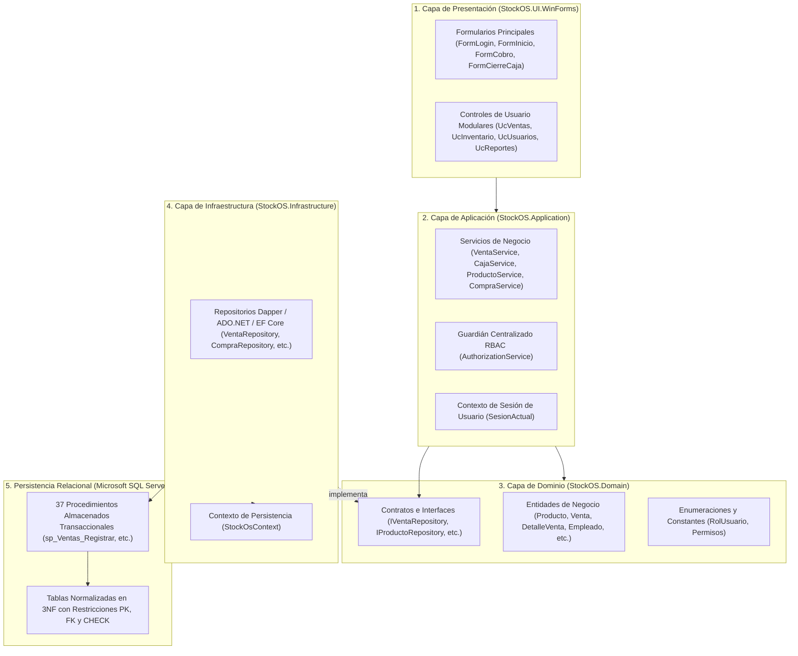
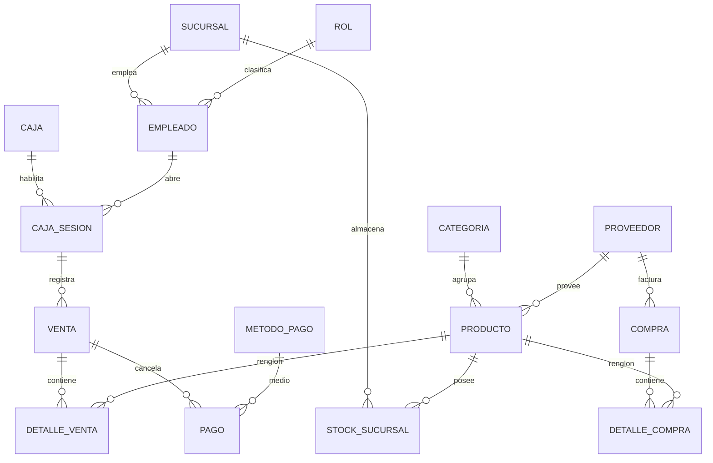

# Dossier Técnico de Ingeniería: Arquitectura, Reglas de Negocio, Base de Datos y Lógica Transaccional — StockOS

**Proyecto:** StockOS — Sistema de Gestión Comercial, Punto de Venta (POS) e Inventario  
**Institución:** Universidad Nacional del Nordeste (UNNE) — Facultad de Ciencias Exactas y Naturales y Agrimensura (FaCENA)  
**Cátedra:** Taller de Programación 2 (2026)  
**Evaluador Principal:** Prof. Juan Carruthers  
**Desarrolladores:** Arnica, Saúl Agustín (D.N.I. 43.205.368) y Zimerman, Benjamín (D.N.I. 43.064.294)  
**Destinatario:** Ingenieros de Software, Arquitectos de Soluciones y Docentes Evaluadores  
**Objetivo del Documento:** Guía técnica y conceptual para exponer con solvencia la arquitectura, la implementación de reglas de negocio, el motor relacional de base de datos con sus Stored Procedures (SPs) y la lógica transaccional de StockOS.

---

## 1. Visión General de la Arquitectura de Software

StockOS está concebido bajo el paradigma de **Arquitectura en Capas (N-Tier)** desacoplada, gobernada por los principios **SOLID** y el principio de Inversión de Dependencias (**IoC / DI**). 



### Principios Arquitectónicos Clave para Destacar en la Exposición

1. **Inversión de Dependencias (DIP):** Los servicios de la Capa de Aplicación jamás dependen de clases concretas de acceso a datos; dependen exclusivamente de abstracciones (`IVentaRepository`, `IStockSucursalRepository`, etc.) declaradas en la Capa de Dominio.
2. **Ciclo de Vida de Inyección en `Program.cs`:**
   - **`Singleton`:** `IConfiguration`, Logger de `Serilog`.
   - **`Scoped`:** `StockOsContext`, Servicios de Negocio (`VentaService`, `CajaService`, etc.) y Repositorios. Cada inicio de sesión de usuario en el bucle principal de `Program.cs` se ejecuta dentro de un `CreateScope()` independiente, garantizando que el `DbContext` y las conexiones a BD se liberen limpiamente sin fugas de memoria al cerrar sesión.
   - **`Transient`:** Formularios y UserControls WinForms, instanciándose frescos ante cada apertura para evitar problemas de estado residual.
3. **Manejo Centralizado de Excepciones y Logging:**
   - En Windows Forms, las excepciones en eventos de interfaz no alcanzan el `catch` general de `Main`. StockOS se suscribe a `Application.ThreadException` y `AppDomain.CurrentDomain.UnhandledException`, canalizando todos los errores hacia **Serilog** con rotación diaria en `logs/stockos-.txt`.

---

## 2. Implementación de Reglas de Negocio en la Capa de Aplicación

Las reglas de negocio de StockOS se encuentran centralizadas en `StockOS.Application`, actuando como una barrera lógica previa a la persistencia.

### 2.1. Seguridad y Control de Acceso por Roles (RBAC)
* **Componentes:** `AuthorizationService.cs`, `IAuthorizationService`, clase estática `Permisos`.
* **Mecanismo:** La Capa de Aplicación indexa en un diccionario estático los permisos para cada `RolUsuario` (`Administrador`, `Cajero`, `Encargado de Depósito`, `Repositor`).
* **Invariante:** Cada servicio de negocio invoca `_authService.ValidarPermiso(Permisos.X)` antes de ejecutar cualquier lógica. Si el usuario logueado en `SesionActual` no tiene el rol correspondiente, se aborta la ejecución con `UnauthorizedAccessException`, impidiendo cualquier invocación a la base de datos.
* **Reflejo en la UI:** Formularios como `FormInicio` y `UcInventario` consumen `_authService.TienePermiso(...)` para ocultar o deshabilitar pestañas y botones, logrando coherencia visual con la regla de negocio.

### 2.2. Algoritmo de Distribución Ponderada de Descuentos
* **Problema Comercial:** Aplicar un descuento global fijo (ej. \$300) dividiéndolo linealmente entre ítems provoca pérdida de centavos por redondeo e introduce el riesgo de arrojar subtotales negativos en productos de bajo precio.
* **Implementación en `UcVentas.cs`:**
  $$\text{Descuento Línea } i = \text{Round}\left(\text{Descuento Total} \times \frac{\text{Subtotal}_i}{\text{Total Bruto}}, 2\right)$$
  El último renglón de la canasta absorbe la diferencia matemática residual:
  $$\text{Descuento}_{\text{último}} = \text{Descuento Total} - \sum_{i=1}^{n-1} \text{Descuento}_i$$
  Garantizando que la sumatoria de líneas coincida con precisión bancaria con el total cobrado.

### 2.3. Formación de Precios y Normalización de IVA (21%)
* **Problema Comercial:** Inconsistencias en el cálculo del precio de venta final a partir del costo del proveedor.
* **Implementación:** La formación de precios se rige por la regla matemática:
  $$\text{Precio Venta Final} = \big(\text{Costo Reposición} \times (1 + \text{Margen de Ganancia})\big) \times 1.21$$
* **Blindaje:** El servicio normaliza y persiste la alícuota del **21.00%** de forma explícita. El ticket fiscal calcula la base imponible neta ($\text{Neto} = \text{Total} / 1.21$) y el débito fiscal ($\text{IVA} = \text{Total} - \text{Neto}$).

### 2.4. Seguridad Criptográfica de Identidad
* **Implementación en `EmpleadoService.cs`:**
  - **Alta de Usuario:** `BCrypt.Net.BCrypt.HashPassword(password, workFactor: 11)`. El algoritmo incorpora sal aleatoria automática y un costo computacional resistente a ataques de fuerza bruta.
  - **Edición de Usuario:** Si el usuario edita datos personales y deja el campo de contraseña vacío, el servicio preserva el hash previo sin corromperlo ni sobreescribirlo con cadenas vacías.
  - **Autenticación:** Validación segura mediante `BCrypt.Net.BCrypt.Verify(passwordPlano, hashAlmacenado)`.

---

## 3. Base de Datos Relacional y Procedimientos Almacenados (SPs)

La base de datos de StockOS fue diseñada en **Tercera Forma Normal (3NF)** para erradicar la redundancia y garantizar la integridad referencial. Toda interacción de escritura y lectura crítica se realiza mediante **37 Procedimientos Almacenados**.



### 3.1. Inventario de los 37 Stored Procedures por Subsistema

1. **Gestión de Empleados y Seguridad (5 SPs):**
   - `sp_Usuarios_Insertar`: Crea empleado con credenciales y devuelve `@IdEmpleado OUTPUT`.
   - `sp_Usuarios_Autenticar`: Obtiene credenciales y estado del usuario por DNI o Email.
   - `sp_Usuarios_Actualizar`: Modifica datos personales y rol.
   - `sp_Usuarios_CambiarEstado`: Aplica baja lógica (`estado = 0`) o reactivación.
   - `sp_Usuarios_ConsultarEstado`: Valida si el empleado está activo antes de operar.
2. **Catálogo de Categorías (3 SPs):**
   - `sp_Categorias_Insertar`, `sp_Categorias_Actualizar`, `sp_Categorias_ObtenerTodas`.
3. **Catálogo de Productos (4 SPs):**
   - `sp_Productos_Insertar`: Alta de artículo con asignación de ID mediante `SCOPE_IDENTITY()`.
   - `sp_Productos_ObtenerTodos`: Consulta con joins hacia categorías y proveedores.
   - `sp_Productos_Actualizar`: Modificación de precios, alícuotas y descripción.
   - `sp_Productos_CambiarEstado`: Baja lógica (`activo = 0`).
4. **Padrón de Proveedores (4 SPs):**
   - `sp_Proveedores_Insertar`, `sp_Proveedores_Actualizar`, `sp_Proveedores_CambiarEstado`, `sp_Proveedores_ObtenerTodos`.
5. **Gestión de Compras y Abastecimiento (4 SPs):**
   - `sp_Compras_Insertar`: Alta de cabecera de compra vinculada a sucursal y empleado.
   - `sp_DetalleCompra_Insertar`: Renglones individuales de compra.
   - `sp_Compras_ObtenerUltimoPrecio`: Recupera el costo más reciente para reposición.
   - `sp_Compras_ActualizarPrecio`: Auditado para mantener inmutabilidad contable histórica.
6. **Control de Inventario y Stock Físico (3 SPs):**
   - `sp_Stock_ObtenerActual`: Lectura de existencias por sucursal.
   - `sp_Stock_IngresarMercaderia`: UPSERT transaccional (inserta si no existe, o incrementa).
   - `sp_Stock_Descontar`: Descuento atómico con control de stock negativo.
7. **Operatoria y Sesiones de Caja (6 SPs):**
   - `sp_Cajas_ObtenerPorSucursal`: Cajas físicas habilitadas.
   - `sp_CajaSesion_Abrir`: Apertura de sesión con monto inicial.
   - `sp_CajaSesion_VerificarAbierta`: Control de unicidad de caja abierta por cajero.
   - `sp_MovimientoCaja_Insertar`: Asiento de ingresos/egresos manuales con validación de tipo.
   - `sp_Caja_CalcularMontoEsperado`: Consolidación contable de recaudación por turno.
   - `sp_CajaSesion_Cerrar`: Cierre de turno y registro de diferencias.
8. **Punto de Venta y Facturación (3 SPs):**
   - `sp_Ventas_Insertar`: Asienta cabecera de venta y total facturado.
   - `sp_DetalleVenta_Insertar`: Persiste cantidades y precio histórico de venta.
   - `sp_Pago_Insertar`: Registra el medio de pago utilizado.
9. **Módulo de Reportes Operativos (4 SPs):**
   - `sp_Reportes_Ventas_Total`, `sp_Reportes_Ventas_Detalle`, `sp_Reportes_Compras_Total`, `sp_Reportes_Compras_Detalle`.

---

### 3.2. Análisis Técnico de los Stored Procedures Neurálgicos

#### A. Stored Procedure `sp_Stock_Descontar`: Blindaje contra Stock Negativo
```sql
CREATE OR ALTER PROCEDURE sp_Stock_Descontar
    @IdProducto INT,
    @IdSucursal INT,
    @CantidadAVender INT
AS
BEGIN
    SET NOCOUNT ON;
    BEGIN TRANSACTION;
    BEGIN TRY
        DECLARE @StockActual INT;

        -- Lectura con bloqueo exclusivo para evitar condiciones de carrera (Race Conditions)
        SELECT @StockActual = stock_actual 
        FROM stock_sucursal WITH (UPDLOCK, ROWLOCK)
        WHERE id_producto = @IdProducto AND id_sucursal = @IdSucursal;

        IF @StockActual IS NULL OR @StockActual < @CantidadAVender
        BEGIN
            -- Eleva error controlado que fuerza el rollback total de la venta
            THROW 50002, 'Stock insuficiente para descontar la venta. La cantidad solicitada supera las existencias.', 1;
        END

        UPDATE stock_sucursal
        SET stock_actual = stock_actual - @CantidadAVender
        WHERE id_producto = @IdProducto AND id_sucursal = @IdSucursal;

        COMMIT TRANSACTION;
    END TRY
    BEGIN CATCH
        IF @@TRANCOUNT > 0
            ROLLBACK TRANSACTION;
        THROW;
    END CATCH
END;
```
* **Aspectos Técnicos para Exponer:**
  1. Uso de `WITH (UPDLOCK, ROWLOCK)`: Impide que dos cajeros simultáneos lean el mismo saldo y vendan la última unidad al mismo tiempo.
  2. Uso de `THROW 50002`: Detiene la ejecución de SQL y genera una excepción en C# que revierte toda la canasta de compras.

#### B. Stored Procedure `sp_Caja_CalcularMontoEsperado`: Cálculo de Arqueo
```sql
CREATE OR ALTER PROCEDURE sp_Caja_CalcularMontoEsperado
    @IdCajaSesion INT,
    @MontoEsperado DECIMAL(12,2) OUTPUT
AS
BEGIN
    SET NOCOUNT ON;
    
    DECLARE @MontoApertura DECIMAL(12,2) = 0;
    DECLARE @TotalVentasEfectivo DECIMAL(12,2) = 0;
    DECLARE @TotalIngresos DECIMAL(12,2) = 0;
    DECLARE @TotalEgresos DECIMAL(12,2) = 0;

    -- 1. Fondo inicial
    SELECT @MontoApertura = ISNULL(monto_apertura, 0)
    FROM caja_sesion WHERE id_caja_sesion = @IdCajaSesion;

    -- 2. Ventas cobradas en Efectivo (id_metodo_pago = 1)
    SELECT @TotalVentasEfectivo = ISNULL(SUM(p.monto), 0)
    FROM pago p
    INNER JOIN venta v ON p.id_venta = v.id_venta
    WHERE v.id_caja_sesion = @IdCajaSesion AND p.id_metodo_pago = 1;

    -- 3. Movimientos manuales normalizados en mayúsculas
    SELECT @TotalIngresos = ISNULL(SUM(monto), 0)
    FROM movimiento_caja
    WHERE id_caja_sesion = @IdCajaSesion AND tipo_movimiento = 'INGRESO';

    SELECT @TotalEgresos = ISNULL(SUM(monto), 0)
    FROM movimiento_caja
    WHERE id_caja_sesion = @IdCajaSesion AND tipo_movimiento = 'EGRESO';

    SET @MontoEsperado = @MontoApertura + @TotalVentasEfectivo + @TotalIngresos - @TotalEgresos;
END;
```
* **Aspectos Técnicos para Exponer:**
  1. **Segregación de Pagos:** Solo suma las ventas cobradas en *Efectivo*. Pagos electrónicos (Débito, Crédito, Mercado Pago) no impactan en el cajón físico, evitando falsas diferencias de arqueo.
  2. **Compatibilidad Estricta:** Coincide exactamente con la restricción `CHECK (tipo_movimiento IN ('INGRESO', 'EGRESO'))`.

---

## 4. Lógica de Funcionamiento Transaccional (Flujos Operativos)

### 4.1. Flujo Neurálgico: Concreción de una Venta en `VentaRepository.cs`
Cuando el cajero presiona «Confirmar Cobro» en el punto de venta, la operación viaja a través del repositorio ejecutando una **Transacción ACID Unificada**:

```csharp
using (var transaction = _context.Database.BeginTransaction())
{
    try
    {
        // Paso 1: Inserta Cabecera de Venta y obtiene el ID mediante parámetro OUTPUT
        _context.Database.ExecuteSqlRaw(
            "EXEC sp_Ventas_Insertar @Subtotal={0}, @DescuentoTotal={1}, @TotalVenta={2}, @IdCajaSesion={3}, @IdCliente={4}, @IdVenta=@IdVenta OUTPUT", ...);

        int idVentaGenerado = (int)idVentaParam.Value;

        // Paso 2: Itera renglones asentando el precio histórico y descontando stock
        foreach (var item in detalles)
        {
            _context.Database.ExecuteSqlRaw(
                "EXEC sp_DetalleVenta_Insertar @Cantidad={0}, @PrecioUnitario={1}, @Descuento={2}, @IdVenta={3}, @IdProducto={4}",
                item.Cantidad, item.PrecioUnitarioHistorico, item.Descuento, idVentaGenerado, item.IdProducto);

            _context.Database.ExecuteSqlRaw(
                "EXEC sp_Stock_Descontar @IdProducto={0}, @IdSucursal={1}, @CantidadAVender={2}",
                item.IdProducto, idSucursal, item.Cantidad);
        }

        // Paso 3: Asienta el registro de cobro/pago
        _context.Database.ExecuteSqlRaw(
            "EXEC sp_Pago_Insertar @Monto={0}, @IdMetodoPago={1}, @IdVenta={2}, @ReferenciaTransaccion={3}, @IdPago=@IdPago OUTPUT", ...);

        // Paso 4: Confirmación atómica si todo fue exitoso
        transaction.Commit();
        return idVentaGenerado;
    }
    catch (Exception)
    {
        // Paso 5: Reversión total ante cualquier falla (ej. stock insuficiente en el renglón 3)
        transaction.Rollback();
        throw;
    }
}
```

* **Garantía Transaccional:** Si una canasta tiene 5 productos y el 5º no cuenta con existencias, `sp_Stock_Descontar` lanza un error; el bloque `catch` ejecuta `transaction.Rollback()` y el sistema no descuenta los primeros 4 productos ni graba la cabecera de la venta.

---

## 5. Garantías de Integridad y Robustez del Software

| Invariante | Mecanismo de Control en StockOS | Impacto en el Sistema |
| :--- | :--- | :--- |
| **Integridad de Entidad** | Claves primarias `IDENTITY(1,1)` y restricciones `UNIQUE` (código de barras, DNI, CUIT, nombre de categoría). | Imposibilidad física de duplicar identidades de productos o personas. |
| **Integridad Referencial** | Claves Foráneas estrictas en todas las relaciones. Bajas Lógicas mediante columna `BIT` (`activo`, `estado`). | Se impide el borrado de empleados o productos que posean comprobantes históricos de venta/compra. |
| **Integridad de Dominio** | Restricciones `CHECK` en base de datos y validaciones `ArgumentException` en servicios de aplicación. | Ningún precio, cantidad o monto de apertura puede ser negativo. |
| **Inmutabilidad Fiscal** | Guardado de `precio_unitario_historico` en `detalle_venta` y cálculo de balances sobre datos históricos. | Las modificaciones futuras del catálogo no adulteran la contabilidad pasada. |
| **Aislamiento Concurrente** | Bloqueo por fila (`ROWLOCK`, `UPDLOCK`) en SQL Server y sesiones de caja segregadas por cajero. | Soporta múltiples puestos de cobro en simultáneo sin interferencias. |

---

## 6. Guía Rápida para la Exposición y Defensa Técnica

Al presentar el software ante un docente o evaluador profesional, se recomienda estructurar la exposición en los siguientes ejes:

1. **Introducción y Arquitectura (2 minutos):**
   - Destacar la **Arquitectura N-Tier desacoplada**.
   - Mostrar cómo `Program.cs` registra servicios con `Scoped` y formularios con `Transient`.
   - Explicar que la lógica de negocio está en `Application`, los contratos en `Domain`, la persistencia en `Infrastructure` y la interfaz en `WinForms`.
2. **Defensa en Profundidad y Manejo de Stock (3 minutos):**
   - **Pregunta Típica del Evaluador:** *«¿Cómo garantizan que no haya stock negativo si dos cajeros venden al mismo tiempo?»*
   - **Respuesta Técnica:** *«Aplicamos una estrategia de defensa en dos niveles. En la UI consultamos el stock antes de sumar al ticket para una respuesta rápida al usuario. Pero la garantía real está en la base de datos: dentro del SP `sp_Stock_Descontar` usamos un bloqueo de actualización a nivel de fila (`UPDLOCK, ROWLOCK`), evaluamos si el saldo actual cubre la cantidad y, de lo contrario, disparamos `THROW 50002` que activa el `ROLLBACK` total de la transacción.»*
3. **Inmutabilidad de Precios Históricos (2 minutos):**
   - **Pregunta Típica del Evaluador:** *«Si hoy vendo yerba a \$1.000 y mañana el gerente le cambia el precio a \$1.500, ¿qué pasa con los reportes de ventas del mes pasado?»*
   - **Respuesta Técnica:** *«Permanecen inalterados. La tabla `detalle_venta` almacena `precio_unitario_historico`. Todos los procedimientos de reportes y reimpresión de tickets calculan sobre esta columna y nunca leen el precio actual del catálogo.»*
4. **Seguridad y Control de Acceso (2 minutos):**
   - Explicar el uso de **BCrypt (work factor 11)** para contraseñas de empleados.
   - Mostrar el servicio **`AuthorizationService`**, señalando que los métodos de aplicación lanzan `UnauthorizedAccessException` si un cajero o repositor intenta ejecutar operaciones reservadas al Administrador.
5. **Acreditación de Calidad mediante Pruebas (1 minuto):**
   - Demostrar que el sistema cuenta con **164 pruebas automatizadas** en xUnit cubriendo el 100% de los servicios, con un 100% de éxito en ejecución.

