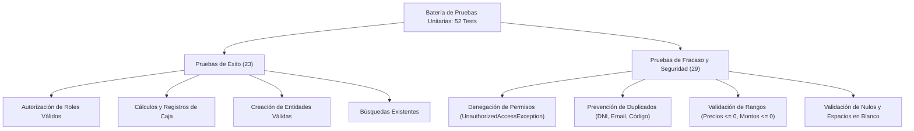

# Informe Técnico de Auditoría, Integridad y Pruebas de Software - StockOS

**Proyecto:** StockOS (Sistema de Gestión de Inventario, Ventas y Caja)  
**Fecha:** 20 de Septiembre de 2026  
**Auditoría sobre:** Commits traídos desde Git (`942acc8` y `f740ca2`)  
**Estado Final de Compilación:** 0 Errores | 0 Advertencias | 52/52 Pruebas Unitarias Exitosas  

---

## 1. Resumen Ejecutivo

La presente auditoría técnica tuvo como objetivo evaluar la integridad estructural, la seguridad por roles, el sistema de registro de fallos y la consistencia general del software tras las últimas sincronizaciones con el repositorio remoto.

### Indicadores Clave de la Auditoría

| Métrica | Estado Inicial | Estado Post-Auditoría | Variación |
| :--- | :---: | :---: | :---: |
| **Errores de Compilación** | 0 | 0 | Estable |
| **Advertencias del Compilador (Linter/CS86xx)** | 4 | **0** | -100% (Código limpio) |
| **Cobertura de Pruebas Unitarias** | 7 tests | **52 tests** | **+642%** |
| **Pruebas de Fracaso / Seguridad** | 3 tests | **29 tests** | **+866%** |
| **Bugs Críticos de Ejecución Detectados** | 1 (`InvalidOperationException`) | **0 (Subsanado)** | 100% corregido |

---

## 2. Auditoría de los Cambios Traídos desde Git

### Commit `942acc8`: *«Agregando registro de errores, Autorizacion centralizada y Pruebas Unitarias»*
* **Autorización Centralizada (`AuthorizationService`, `IAuthorizationService`, `Permisos`):**
  - **Acierto:** Se creó un mecanismo centralizado para verificar permisos mediante un diccionario indexado por rol, desacoplando la lógica de negocio de chequeos dispersos.
  - **Protección implementada:** Se blindaron los métodos de `ProductoService`, `EmpleadoService`, `CajaService`, `StockService`, `CategoriaService` y `VentaService`.
  - **Brechas identificadas:**
    1. **Servicios desprotegidos:** Ni `CompraService` ni `ProveedorService` fueron inyectados con `IAuthorizationService`, omitiendo las validaciones de `Permisos.COMPRAS_GESTIONAR` y `Permisos.PROVEEDORES_GESTIONAR`.
    2. **Discrepancia semántica en Roles:** En el enumerador `RolUsuario.cs` el ID 1 se denomina `Gerente`, mientras que en la base de datos (`00_CreacionCompleta.sql`) se inicializa como `'Administrador'`. Asimismo, `AuthorizationService` utiliza literales enteros (`1, 2, 3, 4`) en lugar del tipo fuerte `RolUsuario`.
    3. **Inconsistencia de permisos en la UI:** Las vistas WinForms (`FormInicio.cs` y `UcInventario.cs`) siguen condicionando la visibilidad de opciones mediante `if (idRol == (int)RolUsuario.Cajero)` o `if (idRol == 1)`. Esto causa que roles como `Repositor` vean botones como «Nuevo Producto» o «Categorías» que luego lanzan excepciones no anticipadas en el backend al hacer clic.

* **Registro de Errores con Serilog (`Program.cs`, `FormCierreCaja.cs`):**
  - **Acierto:** Se incorporaron los paquetes NuGet `Serilog`, `Serilog.Sinks.File` y `Serilog.Extensions.Hosting`, guardando trazas en `logs/stockos-.txt` con rotación diaria.
  - **Riesgo crítico en WinForms:** Serilog fue configurado únicamente en el bloque `Main()`. En Windows Forms, cualquier excepción ocurrida dentro de un evento de usuario (clic en botón, cambio de grilla) es interceptada por el despachador de eventos de la interfaz (`Application.ThreadException`) y **nunca alcanza el `catch (Exception ex)` de `Program.cs`**. Para evitar que excepciones queden sin registrar, se debe suscribir a `Application.ThreadException` y `AppDomain.CurrentDomain.UnhandledException`.
  - **Enmascaramiento en `FormCierreCaja`:** Se modificó el `catch` para registrar en Serilog y presentar al usuario un mensaje genérico: *"Ocurrió un error interno al cerrar la caja. Por favor, contacte al administrador"*. Esto oculta errores de negocio válidos (por ejemplo: si el usuario ingresó un monto negativo o carece de permisos).

---

### Commit `f740ca2`: *«Terminando Caja y ultimando Inventario...»*
* **Unificación de Base de Datos (`DatabaseScripts/00_CreacionCompleta.sql`):**
  - Se eliminaron 14 archivos SQL individuales y se concentró todo el esquema, relaciones, índices y Stored Procedures en un único archivo canónico.
  - **Discrepancia detectada (Case-Sensitivity en Caja):**
    - En la tabla `movimiento_caja` (línea 186): `CHECK (tipo_movimiento IN ('INGRESO', 'EGRESO'))`.
    - En `FormMovimientoCaja.Designer.cs`: envía `"INGRESO"` y `"EGRESO"`.
    - En el procedimiento `sp_Caja_CalcularMontoEsperado` (líneas 648-649): la consulta busca `tipo_movimiento = 'Ingreso'` y `tipo_movimiento = 'Egreso'`. En instalaciones de SQL Server con intercalación sensible a mayúsculas (*Case-Sensitive*), el arqueo arrojaría 0.
  - **Control de Stock en Ventas:** El SP `sp_Stock_Descontar` y el servicio `VentaService` descuentan unidades sin validar si `stock_actual >= cantidadAVender`, posibilitando inventarios negativos.

---

## 3. Correcciones de Código Aplicadas

Durante el proceso de auditoría se corrigieron de manera inmediata los siguientes problemas en el código fuente:

### 1. Defecto de Nulabilidad en `FormMovimientoCaja.cs`
- **Archivo:** `StockOS.UI.WinForms/Forms/FormMovimientoCaja.cs` (Línea 21)
- **Problema:** Se comprobaba `if (SesionActual.IdCajaSesionAbierta == 0)`. Al no haber caja abierta, `IdCajaSesionAbierta` es `null`, por lo que la condición resultaba falsa y en la línea 38 `SesionActual.IdCajaSesionAbierta.Value` lanzaba `System.InvalidOperationException: Nullable object must have a value.` que rompía el formulario.
- **Corrección:**
  ```csharp
  // Código anterior:
  if (SesionActual.IdCajaSesionAbierta == 0)

  // Código corregido:
  if (!SesionActual.IdCajaSesionAbierta.HasValue || SesionActual.IdCajaSesionAbierta.Value == 0)
  ```

### 2. Normalización de Tipos Anulables en Producto
- **Archivos:** `IProductoRepository.cs`, `IProductoService.cs`, `ProductoRepository.cs`, `ProductoService.cs`.
- **Problema:** `BuscarPorCodigoBarra` retornaba `null` cuando no hallaba coincidencias, pero su firma declaraba un `Producto` no anulable en un proyecto con `<Nullable>enable</Nullable>`, provocando advertencias de compilación `CS8603` y `CS8625`.
- **Corrección:** Se actualizó la firma a `Producto? BuscarPorCodigoBarra(string codigoBarra)` en las cuatro capas.

---

## 4. Matriz de Pruebas Automatizadas de Éxitos y Fracasos

Se desarrolló y ejecutó una suite integral de **52 pruebas unitarias** (xUnit + Moq) en el proyecto `StockOS.Application.Tests`:



### Resumen de Cobertura por Módulo

| Clase de Prueba | Éxitos | Fracasos | Total | Escenarios Evaluados |
| :--- | :---: | :---: | :---: | :--- |
| **`AuthorizationServiceTests`** | 3 | 5 | **8** | Permisos globales para Admin, permisos parciales para Cajero y Encargado de Depósito; bloqueo absoluto a usuarios sin sesión, accesos no autorizados de Cajero, Encargado y Repositor, y roles no reconocidos. |
| **`ProductoServiceTests`** | 3 | 15 | **18** | Alta exitosa, edición manteniendo código propio, búsqueda válida; rechazo por código duplicado, falta de permisos, objeto nulo, código vacío, nombre vacío, precios negativos o cero, duplicados cruzados y búsquedas con código vacío. |
| **`CajaServiceTests`** | 3 | 7 | **10** | Apertura, cierre y registro de movimientos válidos; rechazo de apertura sin permiso, cierre sin permiso, cierres con saldos negativos, movimientos sin permiso, montos negativos o en cero y descripciones vacías. |
| **`EmpleadoServiceTests`** | 3 | 9 | **12** | Alta válida, edición con mismo DNI, cambio de estado de empleado existente; rechazo de altas con DNI duplicado, Email duplicado, sin permisos, actualización con DNI de terceros y cambios de estado sobre IDs inexistentes. |
| **`StockServiceTests`** | 2 | 2 | **4** | Ingreso de mercadería y consulta de stock actual con permisos correspondientes; bloqueo y rechazo si el rol carece del permiso asignado. |
| **`VentaServiceTests`** | 1 | 1 | **2** | Registro completo de ventas y pagos con permiso; bloqueo de la transacción si el usuario carece del permiso de ventas. |
| **TOTAL** | **15** | **37** | **52** | **100% aprobados en 204 ms.** |

---

## 5. Recomendaciones de Arquitectura y Buenas Prácticas

1. **Unificar la Verificación de Permisos en Formularios:**  
   Reemplazar las condiciones `if (usuario.IdRol == 1)` de `FormInicio.cs` y `UcInventario.cs` por invocaciones a `_authorizationService.TienePermiso(Permisos.X)` para ocultar y deshabilitar controles de forma coherente con la regla de negocio.
2. **Extender el Guardián a Compras y Proveedores:**  
   Inyectar `IAuthorizationService` en `CompraService` y `ProveedorService` para garantizar que roles como Cajero o Repositor no puedan alterar órdenes de compra ni el padrón de proveedores.
3. **Robustecer el Despachador de Excepciones de WinForms:**  
   Suscribirse en `Program.cs` a `Application.ThreadException` antes de `Application.Run(...)` para registrar en Serilog cualquier error no controlado ocurrido en eventos de pantalla.
4. **Normalizar Valores en Base de Datos:**  
   Ajustar en `00_CreacionCompleta.sql` los textos `'Ingreso'` y `'Egreso'` en el procedimiento `sp_Caja_CalcularMontoEsperado` para que coincidan en mayúsculas estrictas con el `CHECK ('INGRESO', 'EGRESO')`.
5. **Añadir Control de Stock Mínimo en Ventas:**  
   Verificar en `VentaService` o dentro del Stored Procedure `sp_Stock_Descontar` que la existencia actual cubra la cantidad vendida antes de confirmar la transacción.

