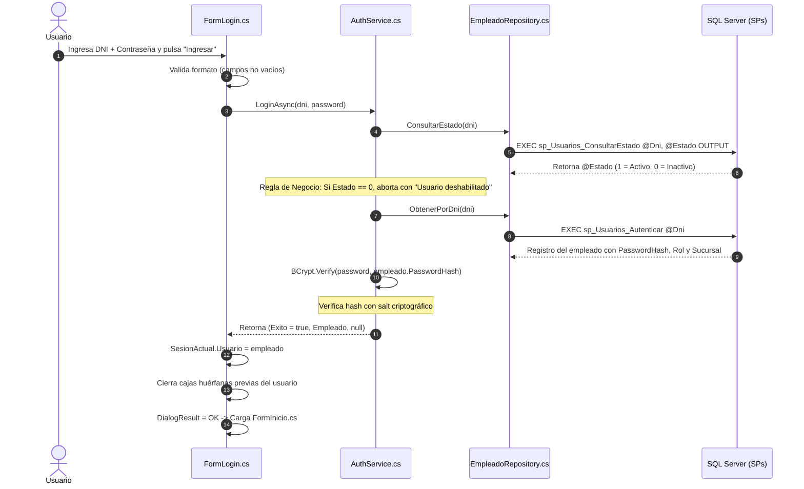
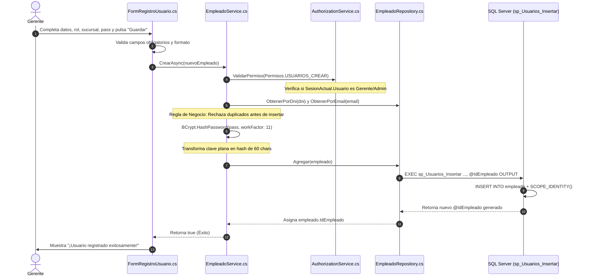
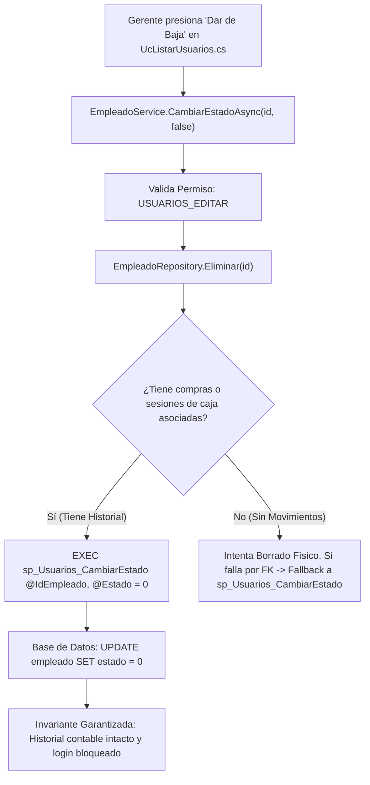

# Informe Técnico de Trazabilidad: Módulo de Usuarios, Autenticación y Seguridad (RBAC)

**Proyecto:** StockOS — Sistema de Gestión Comercial, Punto de Venta (POS) e Inventario  
**Módulo:** Gestión de Usuarios, Autenticación y Seguridad por Roles  
**Institución:** Universidad Nacional del Nordeste (UNNE) — Facultad de Ciencias Exactas y Naturales y Agrimensura (FaCENA)  
**Cátedra:** Taller de Programación 2 (2026)  
**Evaluador:** Prof. Juan Carruthers  
**Autores:** Arnica, Saúl Agustín y Zimerman, Benjamín  
**Objetivo del Documento:** Detallar la trazabilidad técnica, capa por capa y en base de datos, de cada suceso y acción del usuario dentro del módulo de usuarios y seguridad.

---

## 1. Visión Estructural del Módulo entre Capas

El módulo de usuarios abarca la identidad, seguridad criptográfica, control de acceso por roles (RBAC) y la administración de la nómina de personal de la empresa.

```mermaid
flowchart TD
    subgraph UI ["1. Capa de Presentación (WinForms)"]
        FL["FormLogin.cs (Autenticación)"]
        FRU["FormRegistroUsuario.cs (Alta / Modificación)"]
        ULU["UcListarUsuarios.cs (Grilla y Filtros)"]
        FI["FormInicio.cs (Control de Navegación por Rol)"]
    end

    subgraph APP ["2. Capa de Aplicación (Application)"]
        AS["AuthService.cs (Lógica de Login y Criptografía)"]
        ES["EmpleadoService.cs (Reglas de Negocio, Validaciones y CRUD)"]
        AUTH["AuthorizationService.cs (Guardián de Permisos RBAC)"]
        SES["SesionActual.cs (Contexto en Memoria de la Sesión)"]
    end

    subgraph DOMAIN ["3. Capa de Dominio (Domain)"]
        E["Empleado.cs (Entidad)"]
        R["Rol.cs / RolUsuario.cs (Enum)"]
        IER["IEmpleadoRepository.cs (Contrato)"]
        P["Permisos.cs (Constantes de Seguridad)"]
    end

    subgraph INFRA ["4. Capa de Infraestructura (Infrastructure)"]
        ER["EmpleadoRepository.cs (ADO.NET / EF Core)"]
        CTX["StockOsContext.cs (Mapeo Relacional)"]
    end

    subgraph BD ["5. Persistencia Relacional (SQL Server)"]
        SP1["sp_Usuarios_Autenticar"]
        SP2["sp_Usuarios_ConsultarEstado"]
        SP3["sp_Usuarios_Insertar"]
        SP4["sp_Usuarios_Actualizar"]
        SP5["sp_Usuarios_CambiarEstado"]
        TBL["Tabla: empleado (3NF, FKs, UQ)"]
    end

    FL --> AS
    FRU --> ES
    ULU --> ES
    FI --> AUTH
    AS --> IER
    ES --> IER
    ES --> AUTH
    ER -. implementa .-> IER
    ER --> CTX
    ER --> SP1
    ER --> SP2
    ER --> SP3
    ER --> SP4
    ER --> SP5
    SP1 & SP2 & SP3 & SP4 & SP5 --> TBL
```



---

## 2. Trazabilidad por Sucesos de Negocio (Paso a Paso)

---

### SUCESO 1: El Empleado Inicia Sesión en el Sistema (Login)



#### 1. Capa de Presentación (UI) — `FormLogin.cs`
* **Método / Evento:** `btnIngresar_Click(sender, e)`.
* **Acción:** Lee `txtUsuario.Text` (DNI) y `txtPassword.Text`.
* **Regla de Validación:** Si alguno está vacío, emite `"DNI y contraseña son obligatorios"` sin invocar capas inferiores.
* **Llamada saliente:** `await _authService.LoginAsync(dni, password);`.

#### 2. Capa de Aplicación — `AuthService.cs`
* **Método:** `LoginAsync(string dni, string password)`.
* **Regla de Negocio 1 (Verificación Temprana de Estado):**  
  Invoca `_empleadoRepository.ConsultarEstado(dni)`. Si el empleado existe pero fue dado de baja lógica (`estadoDb == false`), retorna de inmediato `(false, null, "Usuario deshabilitado")`.
* **Regla de Negocio 2 (Existencia del Empleado):**  
  Invoca `_empleadoRepository.ObtenerPorDni(dni)`. Si retorna `null`, devuelve `(false, null, "Credenciales incorrectas.")`.
* **Regla de Negocio 3 (Criptografía Irreversible):**  
  Ejecuta `BCrypt.Net.BCrypt.Verify(password, empleado.PasswordHash)`. El algoritmo extrae el salt interno del hash y realiza el cómputo matemático. Si la contraseña no coincide, rechaza el acceso.

#### 3. Capa de Infraestructura — `EmpleadoRepository.cs`
* **Método 1:** `ConsultarEstado(string dni)`:  
  Prepara un `SqlParameter` de salida (`@Estado OUTPUT`) de tipo `SqlDbType.Bit` y ejecuta:
  ```csharp
  _context.Database.ExecuteSqlRaw(
      "EXEC sp_Usuarios_ConsultarEstado @Dni={0}, @Estado=@Estado OUTPUT", dni, paramEstado);
  ```
* **Método 2:** `ObtenerPorDni(string dni)`:  
  Invoca el SP mediante EF Core y resuelve las navegaciones hacia `Rol` y `Sucursal`:
  ```csharp
  var empleado = _context.Empleados
      .FromSqlRaw("EXEC sp_Usuarios_Autenticar @Dni={0}", dni)
      .AsEnumerable()
      .FirstOrDefault();
  ```

#### 4. Capa de Base de Datos (SQL Server) — `00_CreacionCompleta.sql`
* **Procedimiento `sp_Usuarios_ConsultarEstado`:**
  ```sql
  CREATE OR ALTER PROCEDURE sp_Usuarios_ConsultarEstado
      @Dni VARCHAR(20), @Estado BIT OUTPUT
  AS
  BEGIN
      SET NOCOUNT ON;
      SET @Estado = NULL;
      SELECT @Estado = estado FROM empleado WHERE dni = @Dni;
  END
  ```
* **Procedimiento `sp_Usuarios_Autenticar`:**
  ```sql
  CREATE OR ALTER PROCEDURE sp_Usuarios_Autenticar
      @Dni VARCHAR(20)
  AS
  BEGIN
      SELECT id_empleado, nombre, apellido, dni, email, direccion, telefono, password_hash, estado, id_rol, id_sucursal
      FROM empleado WHERE dni = @Dni;
  END
  ```

#### 5. Inicialización de Sesión en Memoria — `SesionActual.cs`
Al retornar `exito == true`:
* Se almacena el objeto en `SesionActual.Usuario = empleado`.
* Se invoca `_cajaService.CerrarCajaPorCierreSesion(empleado.IdEmpleado)` para purgar cualquier sesión huérfana previa si el sistema se cerró inesperadamente.
* En `FormInicio.cs`, se consulta `usuario.IdRol` mediante `AuthorizationService.TienePermiso(...)` para configurar dinámicamente qué botones de navegación mostrar (Cajero solo ve Ventas/Inventario; Administrador ve todo el menú).

---

### SUCESO 2: Consulta y Filtrado de Personal (`UcListarUsuarios.cs`)

#### 1. Capa de Presentación (UI) — `UcListarUsuarios.cs`
* **Método / Evento:** `CargarDatos()`.
* Invoca `_empleadoService.ObtenerTodos()`.

#### 2. Capa de Aplicación — `EmpleadoService.cs`
* **Método:** `ObtenerTodos()`.
* **Regla de Negocio (RBAC):**  
  `_authService.ValidarPermiso(Permisos.USUARIOS_VER)`. Si el rol activo carece del permiso, eleva `UnauthorizedAccessException`.

#### 3. Capa de Infraestructura — `EmpleadoRepository.cs`
* **Método:** `ObtenerTodos()`.
* Ejecuta:
  ```csharp
  return _context.Empleados
      .Include(e => e.IdRolNavigation)
      .Include(e => e.IdSucursalNavigation)
      .ToList();
  ```

#### 4. Filtrado en Memoria (UI):
* En `AplicarFiltros()`, filtra en tiempo real sobre la colección en memoria por DNI, Nombre, Apellido, Email y Estado (`Solo Activos`, `Solo Inactivos`), formateando el DataGridView (texto verde para activos, gris para inactivos).

---

### SUCESO 3: El Gerente Registra un Nuevo Empleado (Alta / Create)



#### 1. Capa de Presentación (UI) — `FormRegistroUsuario.cs`
* **Método / Evento:** `btnGuardar_Click(sender, e)`.
* **Validación en Cliente:** Verifica que no haya campos en blanco (`Nombre`, `Apellido`, `DNI`, `Email`, `Dirección`, `Celular`, `Password`, `Rol`, `Sucursal`).
* **Instanciación:** Crea una entidad `Empleado` con `Estado = true` y envía la contraseña en texto plano en la propiedad `PasswordHash` para que la capa de aplicación la procese.
* **Llamada:** `await _empleadoService.CrearAsync(nuevoEmpleado);`.

#### 2. Capa de Aplicación — `EmpleadoService.cs`
* **Método:** `CrearAsync(Empleado empleado)`.
* **Regla de Negocio 1 (Guardián de Permisos RBAC):**
  ```csharp
  _authService.ValidarPermiso(Permisos.USUARIOS_CREAR);
  ```
  Si el usuario autenticado en la sesión es un *Cajero* o *Repositor*, se lanza `UnauthorizedAccessException` y la operación se cancela de raíz.
* **Regla de Negocio 2 (Prevención de Duplicidad):**
  Consulta al repositorio `ObtenerPorDni` y `ObtenerPorEmail`. Si alguno existe, retorna `false` impidiendo registros duplicados.
* **Regla de Negocio 3 (Cifrado Criptográfico Obligatorio):**
  ```csharp
  if (!string.IsNullOrWhiteSpace(empleado.PasswordHash) && !empleado.PasswordHash.StartsWith("$2"))
  {
      empleado.PasswordHash = BCrypt.Net.BCrypt.HashPassword(empleado.PasswordHash, 11);
  }
  ```
  La contraseña se convierte en un hash irreversible con sal aleatoria antes de salir de la capa de aplicación.

#### 3. Capa de Infraestructura — `EmpleadoRepository.cs`
* **Método:** `Agregar(Empleado empleado)`.
* **Preparación de Parámetros:** Define los 10 parámetros de SQL Server tipados (`SqlDbType.VarChar`, `SqlDbType.Int`) sanitizando nulos en dirección y teléfono con `DBNull.Value`.
* **Captura de Identidad:** Declara `@IdEmpleado OUTPUT`.
* **Ejecución:**
  ```csharp
  _context.Database.ExecuteSqlRaw(
      "EXEC sp_Usuarios_Insertar @Nombre, @Apellido, @Dni, @Email, @Direccion, @Telefono, @PasswordHash, @IdRol, @IdSucursal, @IdEmpleado OUTPUT",
      ...);
  empleado.IdEmpleado = (int)idParam.Value;
  ```

#### 4. Capa de Base de Datos (SQL Server) — `00_CreacionCompleta.sql`
* **Procedimiento `sp_Usuarios_Insertar`:**
  ```sql
  CREATE OR ALTER PROCEDURE sp_Usuarios_Insertar
      @Nombre VARCHAR(50), @Apellido VARCHAR(50), @Dni VARCHAR(20), @Email VARCHAR(100),
      @Direccion VARCHAR(255), @Telefono VARCHAR(30), @PasswordHash VARCHAR(255),
      @IdRol INT, @IdSucursal INT, @IdEmpleado INT OUTPUT
  AS
  BEGIN
      INSERT INTO empleado (nombre, apellido, dni, email, direccion, telefono, password_hash, estado, id_rol, id_sucursal)
      VALUES (@Nombre, @Apellido, @Dni, @Email, @Direccion, @Telefono, @PasswordHash, 1, @IdRol, @IdSucursal);
      
      SET @IdEmpleado = SCOPE_IDENTITY();
  END
  ```
* **Garantías de Integridad en Motor SQL:**
  1. `FK__empleado__id_rol`: Valida que el rol exista en la tabla `rol`.
  2. `FK__empleado__id_sucursal`: Valida que la sucursal exista en la tabla `sucursal`.
  3. `UQ__empleado__dni` y `UQ__empleado__email`: Restricciones únicas a nivel de motor.

---

### SUCESO 4: Modificación de un Empleado y Preservación de Clave (Update)

#### 1. Capa de Presentación (UI) — `FormRegistroUsuario.cs`
* **Situación:** El Gerente cambia el teléfono o el rol del empleado, pero **deja el campo de contraseña vacío** porque no desea cambiar la clave del usuario.
* **Llamada:** `await _empleadoService.ActualizarAsync(_empleadoEdicion);`.

#### 2. Capa de Aplicación — `EmpleadoService.cs`
* **Método:** `ActualizarAsync(Empleado empleado)`.
* **Regla de Negocio 1 (Validación Cruzada de Unicidad):**  
  Verifica si el DNI o el Email ya existen, pero asegurándose de que **no pertenezcan a otro empleado distinto**:
  ```csharp
  var empConMismoDni = _empleadoRepository.ObtenerPorDni(empleado.Dni);
  if (empConMismoDni != null && empConMismoDni.IdEmpleado != empleado.IdEmpleado)
  {
      return (false, "El DNI ya se encuentra registrado por otro empleado.");
  }
  ```
* **Regla de Negocio 2 (Preservación de Hash):**  
  Si el usuario escribió una nueva contraseña, la hashea con BCrypt. Si la dejó vacía, **no altera la propiedad**, enviándola nula hacia el repositorio.

#### 3. Capa de Infraestructura — `EmpleadoRepository.cs`
* **Método:** `Actualizar(Empleado empleado)`.
* Mapea el parámetro `@PasswordHash`:
  ```csharp
  new SqlParameter("@PasswordHash", string.IsNullOrWhiteSpace(empleado.PasswordHash) ? DBNull.Value : empleado.PasswordHash)
  ```

#### 4. Capa de Base de Datos (SQL Server) — `00_CreacionCompleta.sql`
* **Procedimiento `sp_Usuarios_Actualizar`:**
  ```sql
  CREATE OR ALTER PROCEDURE sp_Usuarios_Actualizar
      @IdEmpleado INT, @Nombre VARCHAR(50), @Apellido VARCHAR(50), @Dni VARCHAR(20),
      @Email VARCHAR(100), @Direccion VARCHAR(255), @Telefono VARCHAR(30),
      @IdRol INT, @IdSucursal INT, @Estado BIT, @PasswordHash VARCHAR(255)
  AS
  BEGIN
      UPDATE empleado
      SET nombre = @Nombre, apellido = @Apellido, dni = @Dni, email = @Email, 
          direccion = @Direccion, telefono = @Telefono, id_rol = @IdRol, 
          id_sucursal = @IdSucursal, estado = @Estado,
          password_hash = COALESCE(@PasswordHash, password_hash)
      WHERE id_empleado = @IdEmpleado;
  END
  ```
  *Detalle Técnico Clave:* La cláusula `COALESCE(@PasswordHash, password_hash)` evalúa: si `@PasswordHash` es `NULL`, mantiene intacto el hash previo en la base de datos sin blanquearlo.

---

### SUCESO 5: Baja Lógica del Empleado (Deactivate / Soft Delete)



#### 1. Capa de Presentación (UI) — `UcListarUsuarios.cs`
* **Método / Evento:** `BtnDarBaja_Click(sender, e)`.
* Pregunta al usuario mediante cuadro de diálogo si desea desactivar al empleado seleccionado.
* Llama a `await _empleadoService.CambiarEstadoAsync(emp.IdEmpleado, !emp.Estado);`.

#### 2. Capa de Aplicación — `EmpleadoService.cs`
* **Método:** `CambiarEstadoAsync(int id, bool nuevoEstado)`.
* Valida permiso de edición (`Permisos.USUARIOS_EDITAR`).
* Recupera la entidad, muta su propiedad `emp.Estado = nuevoEstado` y delega al repositorio.

#### 3. Capa de Infraestructura — `EmpleadoRepository.cs`
* **Regla de Integridad Referencial Contable:**  
  El repositorio evalúa si el empleado posee registros en las tablas de negocio:
  ```csharp
  bool tieneHistorial = _context.CajaSesiones.Any(c => c.IdEmpleado == id) ||
                        _context.Compras.Any(c => c.IdEmpleado == id);
  ```
  Si tiene historial, **prohíbe el `DELETE` físico** para no violar la integridad referencial ni generar inconsistencias en arqueos de caja históricos. En su lugar, dispara la baja lógica mediante:
  ```csharp
  _context.Database.ExecuteSqlRaw("EXEC sp_Usuarios_CambiarEstado @IdEmpleado={0}, @Estado={1}", id, false);
  ```

#### 4. Capa de Base de Datos (SQL Server) — `00_CreacionCompleta.sql`
* **Procedimiento `sp_Usuarios_CambiarEstado`:**
  ```sql
  CREATE OR ALTER PROCEDURE sp_Usuarios_CambiarEstado
      @IdEmpleado INT, @Estado BIT
  AS
  BEGIN
      UPDATE empleado SET estado = @Estado WHERE id_empleado = @IdEmpleado;
  END
  ```

---

## 3. Matriz Resumen de Componentes Técnicos del Módulo

| Capa | Artefacto / Archivo | Responsabilidad Concreta |
| :--- | :--- | :--- |
| **Presentación (UI)** | `FormLogin.cs` | Captura de credenciales, feedback visual y configuración inicial del entorno de sesión. |
| **Presentación (UI)** | `FormRegistroUsuario.cs` | Formulario polimórfico (Alta y Modificación), validación de campos vacíos en pantalla. |
| **Presentación (UI)** | `UcListarUsuarios.cs` | Grilla de visualización, filtros dinámicos en memoria y disparador de bajas lógicas. |
| **Aplicación** | `AuthService.cs` | Orquestador de autenticación, validación de estado activo y verificación de hashes BCrypt. |
| **Aplicación** | `EmpleadoService.cs` | Aplicación de reglas de negocio (duplicados de DNI/Email, hashing automático y validación RBAC). |
| **Aplicación** | `AuthorizationService.cs` | Guardián centralizado: valida permisos `USUARIOS_VER`, `USUARIOS_CREAR`, `USUARIOS_EDITAR`. |
| **Dominio** | `Empleado.cs` | Modelo de datos del empleado con sus tipos estrictamente tipados. |
| **Dominio** | `RolUsuario.cs` | Enumeración fuertemente tipada (`Gerente = 1, Cajero = 2, EncargadoDeposito = 3, Repositor = 4`). |
| **Infraestructura** | `EmpleadoRepository.cs` | Adaptador de persistencia; prepara parámetros SQL y ejecuta los Stored Procedures. |
| **Base de Datos** | Tabla `empleado` | Tabla en 3NF con constraints `PK`, `UQ (dni)`, `UQ (email)`, `FK (id_rol)`, `FK (id_sucursal)`. |
| **Base de Datos** | Stored Procedures | `sp_Usuarios_Autenticar`, `sp_Usuarios_Insertar`, `sp_Usuarios_Actualizar`, `sp_Usuarios_CambiarEstado`, `sp_Usuarios_ConsultarEstado`. |

---

## 4. Respuestas Clave para Defender este Módulo ante un Evaluador

1. **¿Por qué las contraseñas se hashean en la Capa de Aplicación y no en la UI ni en la BD?**  
   *Respuesta:* Por el principio de responsabilidad única. La interfaz de usuario solo captura entradas del operador y la base de datos solo almacena. La Capa de Aplicación es la dueña de la lógica de negocio y seguridad; centralizar el hashing en `EmpleadoService` y `AuthService` garantiza que ningún flujo alternativo guarde accidentalmente una clave en texto plano.
2. **¿Por qué se utiliza una baja lógica (`sp_Usuarios_CambiarEstado`) en lugar de borrar la fila?**  
   *Respuesta:* Por integridad referencial histórica. Los empleados son claves foráneas en las tablas `caja_sesion`, `venta` y `compra`. Si se borrara físicamente un cajero, la base de datos rechazaría la orden por constraint de FK, o si tuviera cascada, eliminaría las ventas históricas de la empresa, adulterando los balances contables.
3. **¿Cómo se resuelve que la edición de un empleado no sobreescriba la contraseña con vacío?**  
   *Respuesta:* Se resuelve con defensa en dos capas: en `EmpleadoService` se detecta si el campo de texto vino en blanco para no generar un nuevo hash; y en el procedimiento almacenado `sp_Usuarios_Actualizar` se utiliza `password_hash = COALESCE(@PasswordHash, password_hash)`, garantizando a nivel de motor SQL que si el parámetro recibido es `NULL`, la columna conserva su valor previo.

