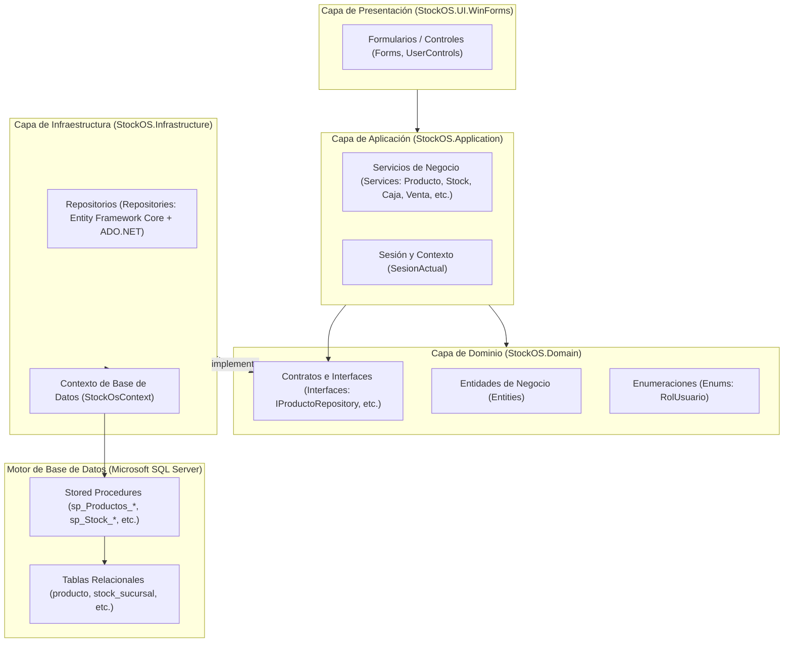
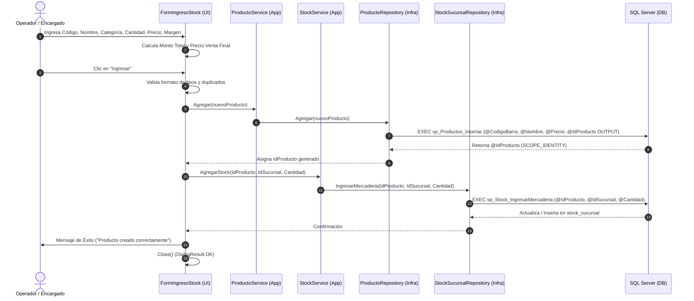

# Relevamiento Técnico CRUD y Matriz de Trazabilidad — StockOS

---

## 1. Introducción y Arquitectura General

El sistema **StockOS** está construido bajo el patrón de **Arquitectura en Capas (N-Tier)** desacoplada, utilizando Inyección de Dependencias (DI) configurada en `Program.cs`.



---

## 2. Relevamiento de Tipos de Datos (Base de Datos vs. C# vs. WinForms)

Se auditó exhaustivamente la correspondencia de tipos de datos, longitudes y tratamiento de valores nulos entre las 3 fronteras: **Controles de UI**, **Modelos C#** y **SQL Server**.

### 2.1. Matriz Comparativa de Tipos

| Entidad / Campo | Tipo en SQL Server | Tipo en C# (Dominio) | Control en WinForms | Validación / Transformación en UI | Estado de Integridad |
| :--- | :--- | :--- | :--- | :--- | :--- |
| **`producto.id_producto`** | `INT IDENTITY(1,1) PK` | `int` | Oculto (`colId` en DataGridView) | `Convert.ToInt32(...)` | ✅ Correcto (Autonumérico / OUTPUT) |
| **`producto.codigo_barra`** | `VARCHAR(50) UNIQUE` | `string` | `TextBox` (`txtCodigo`) | `Trim()`, validación duplicados | ⚠️ Sugerido fijar `MaxLength = 50` |
| **`producto.nombre`** | `VARCHAR(100)` | `string` | `TextBox` (`txtNombreProducto`) | `Trim()`, `string.IsNullOrWhiteSpace` | ⚠️ Sugerido fijar `MaxLength = 100` |
| **`producto.descripcion`** | `VARCHAR(255)` | `string` | N/A (oculto en UI) | Asignación automática de `""` | ✅ Correcto (Previene excepción DBNull) |
| **`producto.precio_venta_actual`**| `DECIMAL(12,2)` | `decimal` | `TextBox` (`txtPrecioVenta`) | `decimal.TryParse(...)` / Calculado | ✅ Correcto (`0.00` formateado) |
| **`producto.porcentaje_iva`** | `DECIMAL(5,2)` | `decimal` | N/A (por defecto `0.00m`) | Valor numérico asignado en C# | ✅ Correcto |
| **`producto.id_categoria`** | `INT FK` | `int` | `ComboBox` (`cmbCategoria`) | `(int)cmbCategoria.SelectedValue` | ✅ Correcto (Validación `> 0` y `!= null`) |
| **`producto.activo`** | `BIT DEFAULT 1` | `bool?` | `ComboBox` / DataGridView | `(bool) == true` / `Activo` vs `Inactivo` | ✅ Correcto |
| **`categoria.id_categoria`**| `INT IDENTITY(1,1) PK` | `int` | DataGridView oculto | `Convert.ToInt32(...)` | ✅ Correcto (Autonumérico / OUTPUT) |
| **`categoria.nombre`** | `NVARCHAR(100) UNIQUE`| `string` | `TextBox` (`txtNombre`) | `Trim()`, validación duplicados | ✅ Correcto (`NVARCHAR` soporta acentos) |
| **`categoria.descripcion`** | `NVARCHAR(255)` | `string` | `TextBox` (`txtDescripcion`) | `Trim()` | ✅ Correcto |
| **`categoria.activo`** | `BIT DEFAULT 1` | `bool` | DataGridView | Estilo visual (Verde / Gris) | ✅ Correcto |
| **`stock_sucursal.stock_actual`**| `INT` | `int` | `TextBox` / Grilla (`txtCantidad`)| `int.TryParse(...)` | ✅ Correcto (Admite diferencias +/-) |
| **`caja_sesion.monto_apertura`** | `DECIMAL(12,2)` | `decimal` | `TextBox` (`txtMonto`) | `decimal.TryParse(...)` | ✅ Correcto |
| **`caja_sesion.monto_cierre_real`**| `DECIMAL(12,2)` | `decimal?` | `TextBox` (`txtMontoReal`) | `decimal.TryParse(...)` | ✅ Correcto |
| **`empleado.dni`** | `VARCHAR(20) UNIQUE` | `string` | `TextBox` (`txtDNI`) | `Trim()`, validación duplicados | ✅ Correcto |
| **`empleado.password_hash`** | `VARCHAR(255)` | `string` | `TextBox` (`txtPassword`) | `BCrypt.Net.BCrypt.HashPassword` | ✅ Correcto (Cifrado 60 caracteres) |
| **`venta.total_venta`** | `DECIMAL(12,2)` | `decimal` | `Label` (`lblTotal`) | Suma acumulada de renglones | ✅ Correcto (Manejo transaccional) |

---

## 3. Análisis de Manejo de Datos Críticos

### 3.1. Manejo de Nulos y Tipos DBNull
1. **El Problema Original**: En Entity Framework Core, al invocar `Database.ExecuteSqlRaw` con parámetros interpolados posicionales (ej. `{0}, {1}`), pasar un objeto C# de tipo `DBNull.Value` arroja `InvalidOperationException: The current provider doesn't have a store type mapping for properties of type 'DBNull'`.
2. **Solución Implementada**:
   - En **Productos**: Se establece cadena vacía `""` como valor por defecto de la descripción (`producto.Descripcion ?? ""`), eliminando el valor nulo antes de la llamada SQL.
   - En **Ventas / Clientes**: Se utiliza instanciación explícita de `SqlParameter` con tipo de dato tipado:
     ```csharp
     var idClienteParam = new SqlParameter("@IdCliente", SqlDbType.Int)
     {
         Value = cabecera.IdCliente ?? (object)DBNull.Value
     };
     ```
   - En **Stock**: Se controla la lectura de parámetros `OUTPUT`:
     ```csharp
     return paramCantidad.Value != System.DBNull.Value ? (int)paramCantidad.Value : 0;
     ```

### 3.2. Formato Decimal y Separadores Regionales
En sistemas operativos en español (es-AR), el separador decimal estándar es la coma `,`, mientras que el teclado numérico a menudo introduce el punto `.`.
- En `FormIngresoStock` y `FormRegistroProducto`, el uso de `decimal.TryParse(texto, out decimal valor)` funciona según la cultura regional del usuario.
- En `txtMonto_KeyPress` (formularios de caja), se permite tanto el punto `.` como la coma `,` para evitar bloqueos al usuario.

---

## 4. Matriz de Trazabilidad Completa (Archivo por Archivo y Capa por Capa)

A continuación se detalla la ruta de ejecución de cada operación CRUD en el sistema.

```
┌──────────────────────────────────────────────────────────────────────────────────────────────────┐
│                                   FLUJO DE TRAZABILIDAD CRUD                                     │
├───────────────┬──────────────────────┬──────────────────────┬────────────────────┬───────────────┤
│ Capa UI       │ Capa Aplicación      │ Capa Dominio         │ Capa Infraestr.    │ Base de Datos │
│ (WinForms)    │ (Services)           │ (Interfaces/Entidad) │ (Repositories)     │ (SP / Tabla)  │
└───────────────┴──────────────────────┴──────────────────────┴────────────────────┴───────────────┘
```

### 4.1. Módulo: Productos e Ingreso de Stock

#### Operación: Alta de Producto con Stock Inicial
1. **Presentación (UI)**:
   - `FormIngresoStock.cs` -> Evento `BtnGuardar_Click`.
   - Valida: Código no nulo, Nombre no nulo, Categoría seleccionada, Cantidad > 0, Precio Compra > 0, Código duplicado mediante `_productoService.ObtenerTodos()`.
   - Calcula: `precioVenta = precioCompra * (1 + margen / 100m)`.
   - Instancia: Entidad `Producto` con `Descripcion = ""`, `Activo = true`.
2. **Aplicación**:
   - `ProductoService.cs` -> Método `Agregar(nuevoProducto)`.
   - `StockService.cs` -> Método `AgregarStock(idProducto, idSucursal, cantidad)`.
3. **Dominio**:
   - `IProductoRepository.cs` -> Firma `void Agregar(Producto producto);`.
   - `IStockSucursalRepository.cs` -> Firma `void IngresarMercaderia(int idProducto, int idSucursal, int cantidad);`.
   - `Producto.cs` -> Entidad de datos.
4. **Infraestructura**:
   - `ProductoRepository.cs` -> Ejecuta `EXEC sp_Productos_Insertar` con parámetro `@IdProducto OUTPUT`. Recupera `(int)idParam.Value` y lo asigna al objeto.
   - `StockSucursalRepository.cs` -> Ejecuta `EXEC sp_Stock_IngresarMercaderia`.
5. **Base de Datos**:
   - `sp_Productos_Insertar`: `INSERT INTO producto (...) VALUES (...); SET @IdProducto = SCOPE_IDENTITY();`.
   - `sp_Stock_IngresarMercaderia`: Verifica existencia en `stock_sucursal`; si existe actualiza con `stock_actual + @CantidadAIngresar`, si no inserta nuevo registro con `stock_minimo = 5`.

#### Operación: Modificación de Producto y Ajuste de Stock
1. **Presentación (UI)**:
   - `UcInventario.cs` -> `EditarSeleccionado()` abre `FormRegistroProducto.cs`.
   - Prellena: Código, Nombre, Categoría, Precio, Estado (`Activo`/`Inactivo`) y Stock Actual.
   - Modificación: El usuario altera precio, estado o stock (ej. de 5 pasa a 2).
   - Calcula: `diferencia = stockFinal - _stockOriginal` (ej. `2 - 5 = -3`).
2. **Aplicación**:
   - `_productoService.Actualizar(_productoEdicion)`.
   - Si `diferencia != 0`, invoca `_stockService.AgregarStock(idProducto, idSucursal, diferencia)`.
3. **Dominio / Infraestructura**:
   - `ProductoRepository.Actualizar()` ejecuta `sp_Productos_Actualizar`.
   - `StockSucursalRepository.IngresarMercaderia()` ejecuta `sp_Stock_IngresarMercaderia` sumando la diferencia algebraica (`+ -3` equivale a restar 3).
4. **Base de Datos**:
   - `sp_Productos_Actualizar` actualiza columnas y `activo`.
   - `sp_Stock_IngresarMercaderia` actualiza `stock_sucursal.stock_actual`.

#### Operación: Dar de Baja / Reactivar Producto (Baja Lógica)
1. **Presentación (UI)**:
   - `UcInventario.cs` -> Evento `BtnEliminar_Click`.
   - Selección dinámica: Al hacer clic sobre la grilla (`DgvProductos_SelectionChanged`), el botón cambia de color y texto automáticamente:
     - Si está **Activo**: Botón rojo "Dar de Baja".
     - Si está **Inactivo**: Botón verde "Reactivar".
   - Invierte estado: `producto.Activo = !estaActivo`.
2. **Aplicación / Infraestructura / BD**:
   - Llama a `_productoService.Actualizar(producto)`, que dispara `sp_Productos_Actualizar` con `@Activo = 0` o `1`.
   - Recarga los datos en memoria y actualiza el color en la grilla (Gris o Verde esmeralda).

---

### 4.2. Módulo: Gestión de Categorías

#### Operación: Alta de Categoría
1. **Presentación (UI)**:
   - `FormCategoria.cs` -> `BtnAgregar_Click`.
   - Valida: Nombre no vacío, unicidad ignorando mayúsculas/minúsculas.
2. **Aplicación**:
   - `CategoriaService.cs` -> `Agregar(nuevaCategoria)`.
3. **Dominio**:
   - `ICategoriaRepository.cs` -> Firma `void Agregar(Categoria categoria);`.
4. **Infraestructura**:
   - `CategoriaRepository.cs` -> Ejecuta `sp_Categorias_Insertar` con `@IdCategoria OUTPUT`.
5. **Base de Datos**:
   - `sp_Categorias_Insertar`: `INSERT INTO categoria (nombre, descripcion, activo) VALUES (@Nombre, @Descripcion, 1)`.

#### Operación: Dar de Baja / Reactivar Categoría
1. **Presentación (UI)**:
   - `FormCategoria.cs` -> `BtnDarBaja_Click`.
   - Invierte `categoria.Activo = !categoria.Activo`.
2. **Infraestructura y BD**:
   - Ejecuta `sp_Categorias_Actualizar` con `@Activo = 0` o `1`.
   - Refresca inmediatamente la grilla de categorías y, al cerrar, el inventario principal.

---

### 4.3. Módulo: Caja y Sesiones

#### Operación: Apertura de Caja
1. **Presentación (UI)**:
   - `FormAperturaCaja.cs` -> `btnAbrir_Click`.
   - Valida que `txtMonto.Text` sea un decimal válido `>= 0`.
2. **Aplicación**:
   - `CajaService.cs` -> `AbrirCaja(idCaja, idEmpleado, montoApertura)`.
   - Guarda en `SesionActual.cs` el `IdCajaSesionAbierta`.
3. **Infraestructura y BD**:
   - `CajaSesionRepository.cs` -> `sp_CajaSesion_Abrir`.
   - Inserta en `caja_sesion` con `fecha_apertura = SYSDATETIME()`.

#### Operación: Cierre de Caja
1. **Presentación (UI)**:
   - `FormCierreCaja.cs` -> `btnConfirmarCierre_Click`.
   - Valida `txtMontoReal` y solicita confirmación.
2. **Infraestructura y BD**:
   - `CajaRepository.cs` -> `sp_CajaSesion_Cerrar`.
   - Registra fecha de cierre, monto de arqueo real y cambia estado a inactivo/cerrado (`0`).

---

### 4.4. Módulo: Ventas (Transacción Compuesta)

#### Operación: Registrar Venta y Descontar Stock
1. **Presentación (UI)**:
   - `UcVentas.cs` -> Abre `FormCobro.cs` y obtiene el método de pago seleccionado.
2. **Aplicación**:
   - `VentaService.cs` -> `RegistrarVenta(cabecera, detalles, idSucursal)`.
3. **Infraestructura (Unidad de Trabajo Transaccional)**:
   - `VentaRepository.cs`:
     1. Abre transacción: `_context.Database.BeginTransaction()`.
     2. Ejecuta `sp_Ventas_Insertar` -> Retorna `idVentaGenerado`.
     3. Itera cada renglón ejecutando `sp_DetalleVenta_Insertar`.
     4. Descuenta el inventario ejecutando `sp_Stock_Descontar`.
     5. Si no hubo fallos: `transaction.Commit()`.
     6. Si ocurre cualquier error: `transaction.Rollback()` para no dejar inventario inconsistente ni ventas huérfanas.

---

### 4.5. Módulo: Usuarios y Autenticación

#### Operación: Login y Cifrado
1. **Presentación (UI)**:
   - `FormLogin.cs` -> `btnIngresar_Click`.
2. **Aplicación**:
   - `AuthService.cs` -> `LoginAsync(dni, password)`.
3. **Infraestructura y Seguridad**:
   - `EmpleadoRepository.ObtenerPorDni(dni)` -> Invoca `sp_Usuarios_Autenticar`.
   - `AuthService` valida contra `BCrypt.Net.BCrypt.Verify(password, hash)`.
   - Si el hash era texto plano heredado, lo auto-actualiza a BCrypt en la base de datos de forma transparente.
   - Asigna `SesionActual.Usuario = empleado; SesionActual.IdSucursal = empleado.IdSucursal`.

---

## 5. Diagrama de Secuencia Integral: Alta de Stock y Modificación



---

## 6. Hallazgos, Recomendaciones y Mejoras de Robustez

| Ámbito | Observación Detectada | Riesgo Potencial | Recomendación de Mejora |
| :--- | :--- | :--- | :--- |
| **Longitudes de Texto** | Los `TextBox` de Código de Barra y Nombre no tienen propiedad `MaxLength` definida en el diseñador. | Si el usuario pega un texto > 50 caracteres para código o > 100 para nombre, SQL Server lanzará error de truncamiento. | Configurar `txtCodigo.MaxLength = 50` y `txtNombreProducto.MaxLength = 100`. |
| **Transaccionalidad en Alta de Stock** | El alta de producto nuevo y la asignación de su stock inicial se ejecutan en 2 comandos separados. | Si falla la red o el servicio de stock tras crear el producto, el producto existirá pero con stock 0 no registrado. | Opcionalmente envolver en `TransactionScope` o unificar en un Stored Procedure orquestador. |
| **Separador Decimal** | `decimal.TryParse(txt, out valor)` usa la cultura de la máquina local. | En máquinas con configuración regional en inglés, escribir coma `,` no parsea correctamente los centavos. | Usar sobrecarga con `NumberStyles.Number, CultureInfo.CurrentCulture` o permitir reemplazo de coma/punto. |
| **Tipos de Parámetros Output** | Todos los SPs usan `SCOPE_IDENTITY()`. | Ninguno; está implementado con las mejores prácticas de SQL Server para evitar colisiones de concurrencia. | Mantener este patrón en futuros SPs. |

---

## 7. Conclusión

El relevamiento demuestra que la arquitectura del sistema **StockOS** está sólidamente estructurada:
- Existe una estricta separación de responsabilidades: la UI sólo captura y valida entradas; los Servicios orquestan las reglas; los Repositorios encapsulan el acceso a datos; y la Base de Datos garantiza la integridad referencial y las operaciones atómicas mediante Stored Procedures.
- Todos los tipos de datos principales (`INT`, `DECIMAL(12,2)`, `BIT`, `VARCHAR`/`NVARCHAR`) están correctamente mapeados en las capas C# y no presentan inconsistencias estructurales.
- Los problemas previos de nulabilidad (`DBNull`) y cierres intempestivos de ventana (`Application.Exit()`) han sido saneados de raíz con soluciones tipadas y estándares de WinForms.

